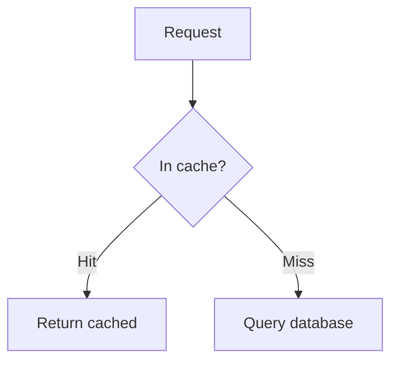
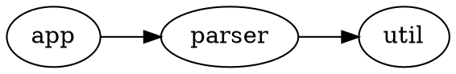

# Diagrams (Mermaid and Graphviz)

Author a diagram as a fenced code block in any prompt, choice, ordering item, or
feedback message. Two languages are recognised:

| Fence                              | Language                                  | Rendered by |
|------------------------------------|-------------------------------------------|-------------|
| ` ```mermaid `                     | [Mermaid](https://mermaid.js.org)         | `mmdc`      |
| ` ```dot ` or ` ```graphviz `      | [Graphviz DOT](https://graphviz.org)      | `dot`       |

````markdown

````

````markdown

````

Fence names are matched in **lower case**, like any other Markdown code fence:
` ```DOT ` is not a diagram and exports as an ordinary code block.

## How it exports

Canvas renders neither language, so on **Canvas export** each diagram is
**rendered to an image** and the code block is replaced with a reference to it.
The image is bundled into the package under `web_resources/generated/` and
rewritten to Canvas's `$IMS-CC-FILEBASE$` reference, exactly like a local prompt
image. Identical diagrams render once and share one file (per language).

The **print sheet keeps the code block** as-is (it is not rendered).

## Requirements

Rendering shells out to a command-line tool, one per language.

**Mermaid** uses the [mermaid CLI](https://github.com/mermaid-js/mermaid-cli):
`mmdc` if it is on your `PATH`, otherwise `npx @mermaid-js/mermaid-cli`.

```bash
npm install -g @mermaid-js/mermaid-cli
```

The mermaid CLI uses a headless browser, so the first run may download one.

**Graphviz** uses `dot`, which must be on your `PATH`:

```bash
sudo dnf install graphviz   # Fedora / RHEL
sudo apt install graphviz   # Debian / Ubuntu
brew install graphviz       # macOS
```

**If a renderer is unavailable**, the export still succeeds: each diagram it
would have handled is **left as a code block** and a warning names it — install
the tool and re-export to render them. The same happens when a diagram fails to
render (a DOT syntax error, say); the warning carries the tool's own message.
You only need the tool for the languages you actually use.

## Options

`--diagram-format <png|svg>` chooses the image format for both languages
(default `png`):

```bash
mdquiz export samples/graphviz/ --output quiz.zip --format canvas --diagram-format svg
```

PNG is the most reliably rendered format inside Canvas; SVG is scalable. See
[`../samples/mermaid/`](../samples/mermaid/) and
[`../samples/graphviz/`](../samples/graphviz/) for runnable examples.
