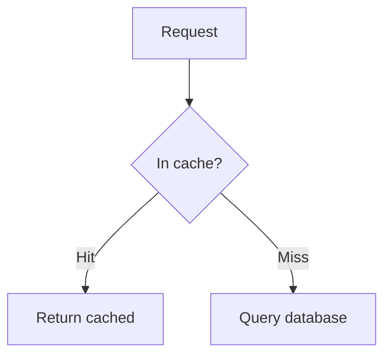

# Mermaid diagrams

Author a diagram as a fenced ` ```mermaid ` code block in any prompt, choice,
ordering item, or feedback message:

````markdown

````

## How it exports

Canvas has no native mermaid support, so on **Canvas export** each diagram is
**rendered to an image** and the code block is replaced with a reference to it.
The image is bundled into the package under `web_resources/generated/` and
rewritten to Canvas's `$IMS-CC-FILEBASE$` reference, exactly like a local prompt
image. Identical diagrams render once and share one file.

The **print sheet keeps the ` ```mermaid ` code block** as-is (it is not
rendered).

## Requirements

Rendering shells out to the **mermaid CLI**. mdquiz uses `mmdc` if it is on your
`PATH`, otherwise `npx @mermaid-js/mermaid-cli`. Install it with:

```bash
npm install -g @mermaid-js/mermaid-cli
```

The CLI uses a headless browser, so the first run may download one.

**If no mermaid CLI is available**, the export still succeeds: each diagram is
**left as a code block** and a warning names it — install the CLI and re-export
to render them.

## Options

`--diagram-format <png|svg>` chooses the image format (default `png`):

```bash
mdquiz export samples/mermaid/ --output quiz.zip --format canvas --diagram-format svg
```

PNG is the most reliably rendered format inside Canvas; SVG is scalable. See
[`../samples/mermaid/`](../samples/mermaid/) for a runnable example.
