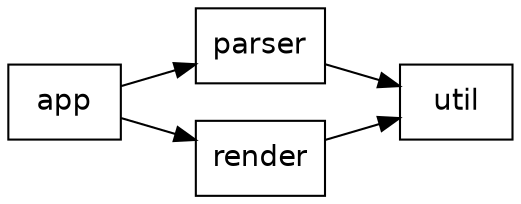

In the dependency graph below an arrow from *A* to *B* means "*A* depends on
*B*". Which module must be compiled **first**?

```dot
digraph deps {
  rankdir=LR;
  node [shape=box, fontname="Helvetica"];
  app -> parser;
  app -> render;
  parser -> util;
  render -> util;
}
```
