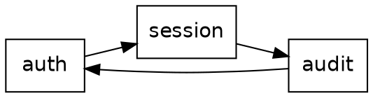

The dependency graph below can be arranged into a valid build order — some
sequence in which every module is built after everything it depends on.

```graphviz
digraph cycle {
  rankdir=LR;
  node [shape=box, fontname="Helvetica"];
  auth -> session;
  session -> audit;
  audit -> auth;
}
```
