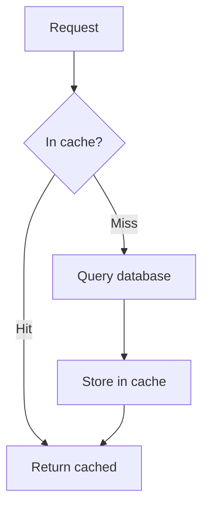

Given the request flow below, a cache **hit** skips the database entirely.

```mermaid
graph TD;
  A[Request] --> B{In cache?};
  B -->|Hit| C[Return cached];
  B -->|Miss| D[Query database];
  D --> E[Store in cache];
  E --> C;
```
